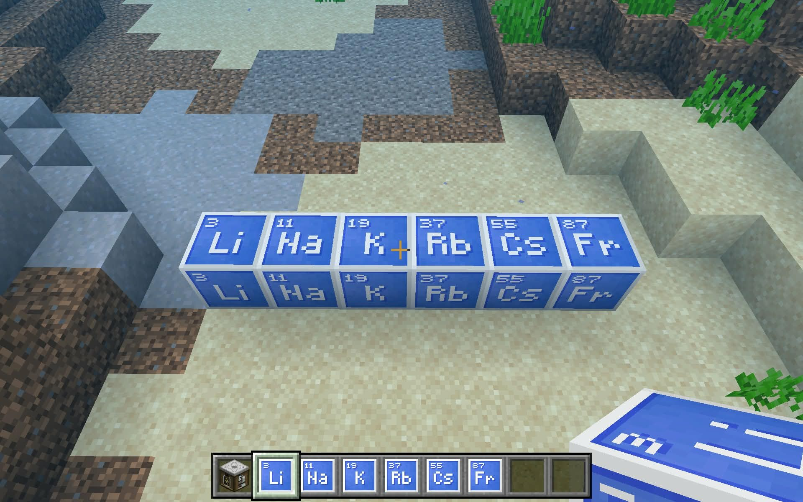

+++
title = "Alkali Metals in water in Minecraft Education"
date = "2026-02-21T14:27:02Z"
author = "Leo"
cover = ""
coverCaption = ""
tags = ["", ""]
keywords = ["", ""]
description = ""
showFullContent = false
readingTime = true
hideComments = false
color = "" #color from the theme settings
+++

# Alkali Metals in water in Minecraft Education

Ex: Na
$$
\ce{2 Na + 2 H2O -> 2 NaOH + H2 ^}
$$
