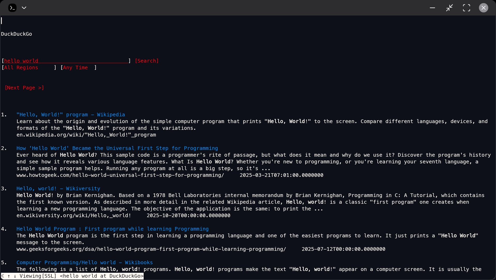
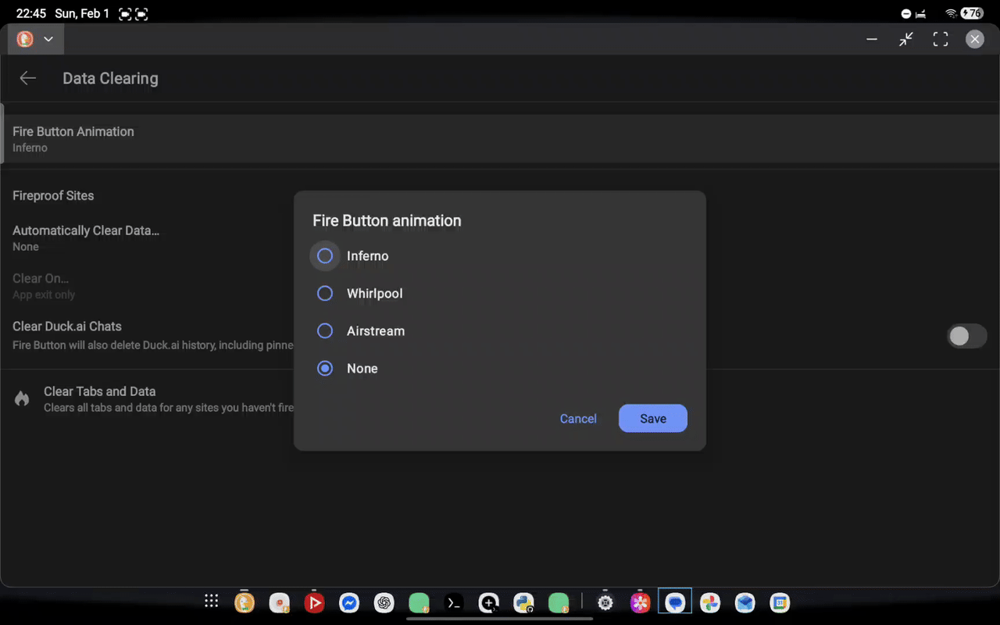

+++
title = "DuckDuckGo"
date = "2026-01-30T14:53:07Z"
author = "Leo"
authorTwitter = "" #do not include @
cover = ""
coverCaption = ""
tags = ["duckduckgo"]
keywords = ["duckduckgo"]
description = "One of the best search engine"
showFullContent = false
readingTime = true
hideComments = false
color = "" #color from the theme settings
+++

Everyone uses Google to search things, but I prefer DuckDuckGo
Why?
Because it has a strong focus on privacy, and it has some interesting things:

## Themes
DuckDuckGo has its own terminal theme that Google doesn't have! Look at this:

## DuckDuckGo in the terminal
What search engine can work in a terminal? DuckDuckGo!  
DuckDuckGo in `w3m` on Termux:

## Clearing (fire) data and tabs
Both DuckDuckGo and Google can clear data, but DuckDuckGo has its cool fire animation!

## Should you use DuckDuckGo?
Of course because why not! It is definely the best search engine!

### DuckDuckGo as a verb
Everyone says to Google because they use Google to search things, but we use DuckDuckGo! So let's say to DuckDuckGo things.
Here are the root, past, and past participle:
> DuckDuckGo - DuckDuckGo'd - DuckDuckGo'd

---
### In Conclusion
Let's start using DuckDuckGo now to DuckDuckGo things! My life has changed since I DuckDuckGo'd things, so you should try it for you!
