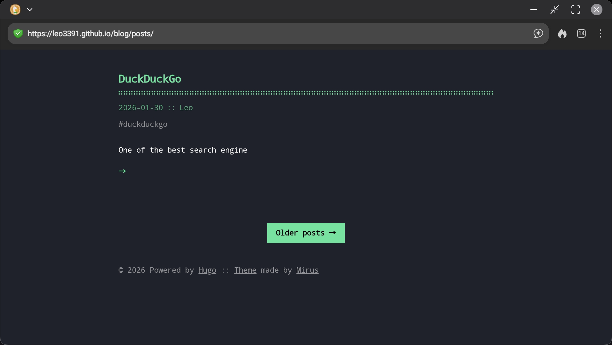

+++
title = "Posts"
date = "2026-03-26T14:51:22Z"
author = "Leo"
cover = ""
coverCaption = ""
description = ""
showFullContent = true
readingTime = true
hideComments = false
color = "" #color from the theme settings
+++

I have enough posts for showing older/newer posts on `/posts`!

